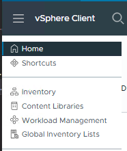
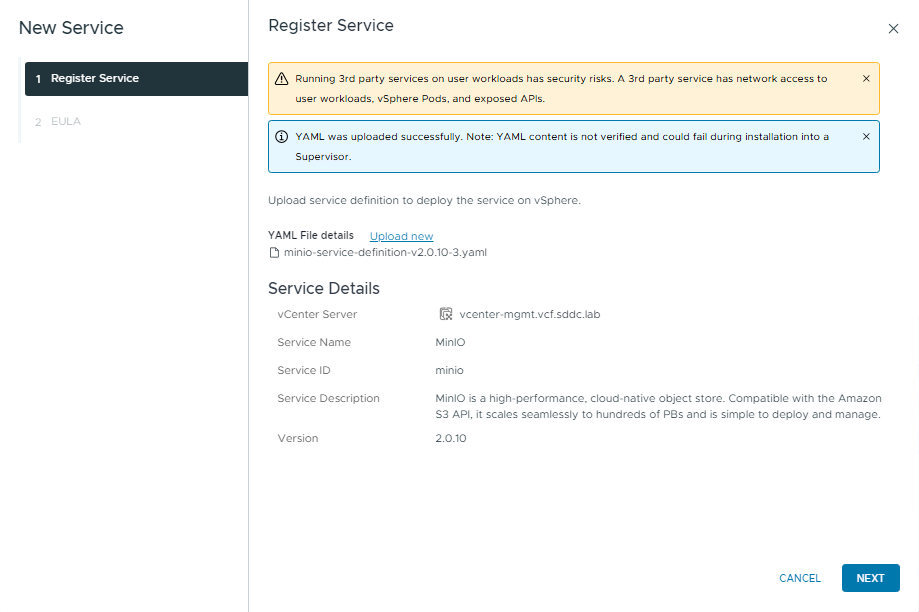
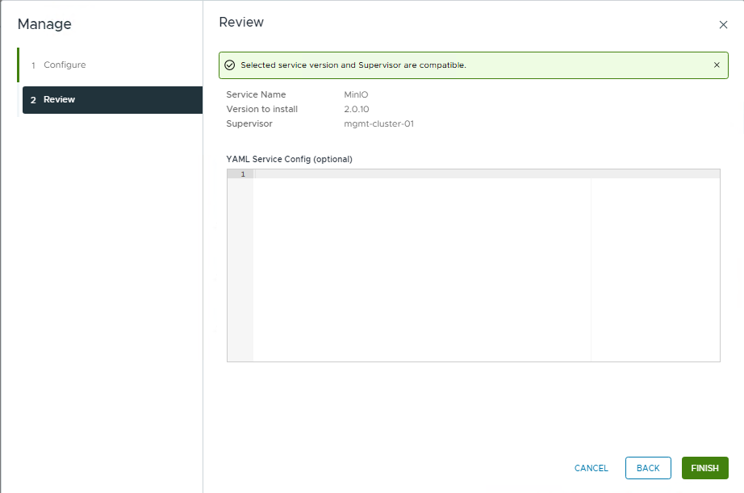
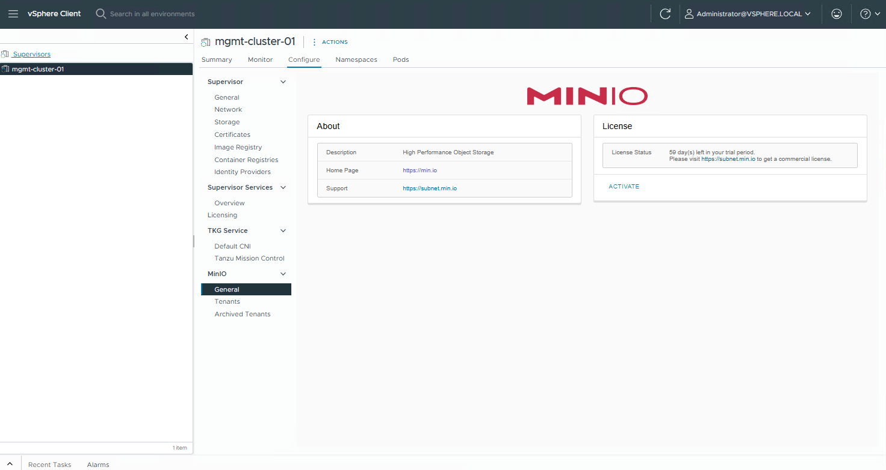

# MinIO Quickstart Guide - vSphere 8 Supervisor Service

From the Berger Menu Select Workload Management

In Workload Management Select Services

Click ADD under Add new Service

Click the URL Discover and download available Supervisor Services here.

Click the URL vSAN Data Persistance Platform (vDPP) Services:

Click the URL for Downlod version: Minio 2.0.10 to download the deployment yaml for the Minio Service.

Go back to vCenter and click Upload, select the downloaded minio yaml file

Click NEXT

Accept the EULA

Click FINISH

Once the Service is deployed to vSphere it needs to added to the Supervisor

Click ACTIONS under Minio

Select Manage Service

