SSH to a TKG cluster node as the ***vmware-system-user*** using a private key:

You can connect through SSH to any TKG cluster node as the ***vmware-system-user user*** 

The secret that contains the SSH private key is named ***cluster-name-ssh***

To connect to a TKG cluster node over SSH using a private key, you can create a jump box vSphere Pod on Supervisor.

Note: With this guide you provision a vSphere Pod as a jump host for SSH connectivity. 
vSphere Pods require NSX networking for Supervisor. 
If you are using vDS networking for Supervisor, you will need to use SSH-to-TKG Service Cluster Nodes as the System User Using a Password.

Guidance:

1. Connect to your Supervisor using CLI and kubectl

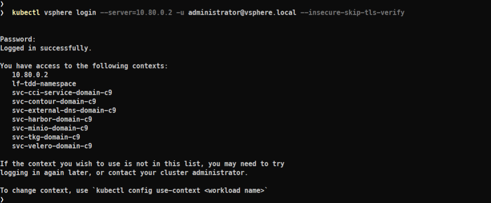

***kubectl vsphere login --server=10.80.0.2 -u administrator@vsphere.local --insecure-skip-tls-verify***

2. Switch CLI context to your target Namespace and get the name of your target TKG cluster

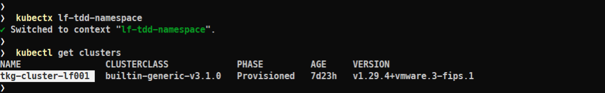

***kubectx lf-tdd-namespace***

***kubectl get clusters***

3. Inspect the secret of your target TKG cluster

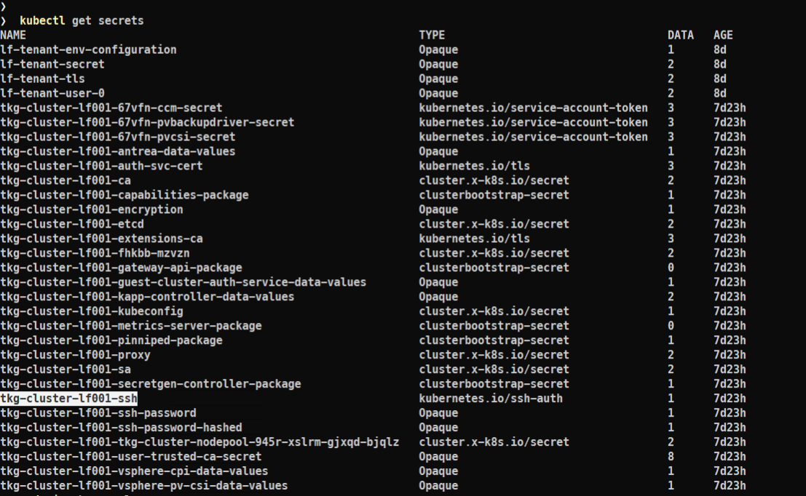

***kubectl get secrets***

4. Modify the ***jumpbox.yaml*** specification. Make sure replacing with your exact values your Namespace and TKG cluster nanme ( see the ***#REPLACE*** comments)

Note: The photon image is being pulled from DockerHub, you might want to pull it from another registry

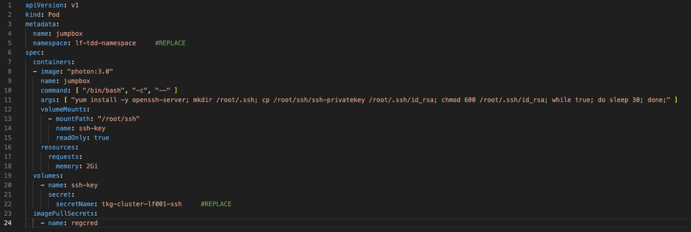

5. Create a jumbox as a vSphere Pod, using the jumbox.yaml . Verify the pod is running

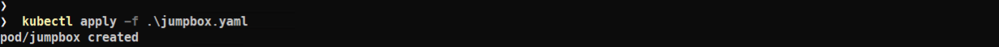

***kubectl apply -f jumpbox.yaml***

6. Verify the pod is running

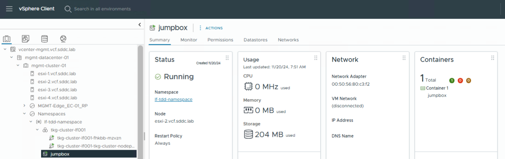

Note: You should also see the jumpbox pod under your Namespace in Inventory (vCenter UI) 

***kubectl get pods***

7. Get the name and Ip address of the virtual machine ( acting as a Master Node of your target TKG cluster)

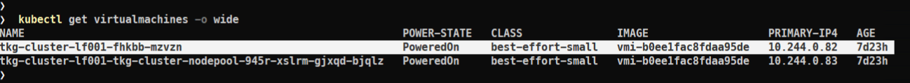

***kubectl get virtualmachines -o wide***

8. SSH as ***vmware-system-user*** to this TKG cluster node (target VM) using the jumbox

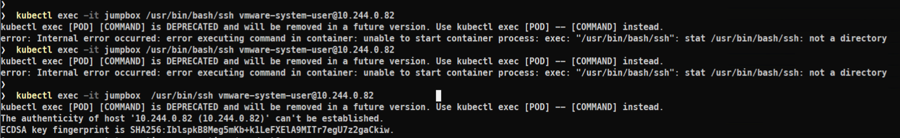

***kubectl exec -it jumpbox  /usr/bin/ssh vmware-system-user@$10.244.0.82***

Note: Be patient, it takes ~ 1-2 min to create the container with the needed configuration. Also, the command might not be accepted at first couple of attempts.
Give it a minute or two, and try again, until you succeed.

9. Confirm the host key. You shoud be logged to the target node as ***vmware-system-user*** now

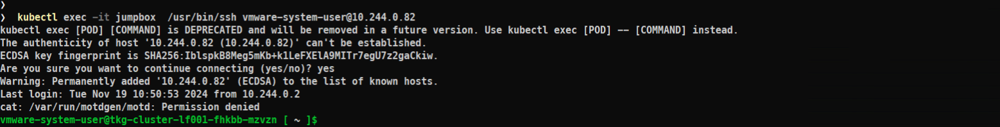

***yes***

10. Get root privileges as necessary

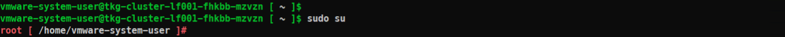

***sudo su***
 
11. Enable kubectl commands against kube-apiserver

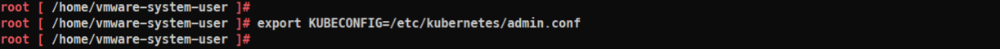

***export KUBECONFIG=/etc/kubernetes/admin.conf***

12. You can go for t-shooting now

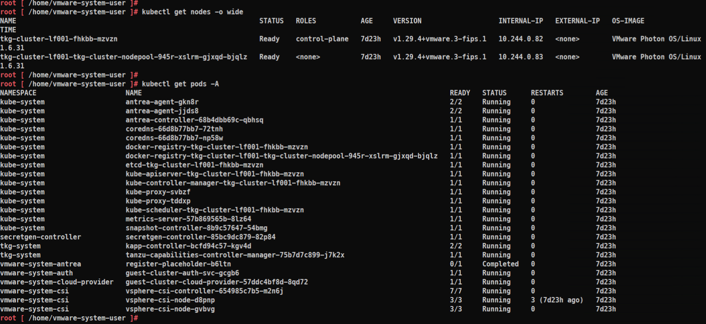

***kubectl get nodes -o wide***

***kubectl get pods -A***

and so on

13. When done, log out from the SSH session in youexpor jumpbox

***exit***

14. Delete the jumpbox pod if not needed anymore

***kubectl delete pod jumpbox***

